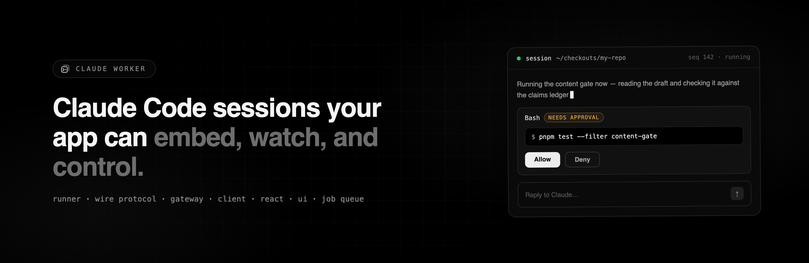

<p align="center">
  
</p>

# claude-worker

<p>
  <a href="https://github.com/tobiasstrebitzer/claude-worker/actions/workflows/ci.yml"></a>
  <a href="https://www.npmjs.com/package/@claude-worker/core"></a>
  <a href="LICENSE"></a>
  <a href="https://tobiasstrebitzer.github.io/claude-worker/"></a>
  = 22" />
</p>

Run a **close-to-real Claude Code session** programmatically via the
[Anthropic Agent SDK](https://code.claude.com/docs/en/agent-sdk), and expose it to a host
application as something it can **embed, watch, and control** — a side-panel that brings Claude
Code into your app.

A session created here behaves like Claude Code launched in the same directory: same skills
(`.claude/skills/`), same `CLAUDE.md`, same MCP config surface, same permission system. The worker
adds the missing hosting layer: a session server your web app can talk to, a typed wire protocol
for the message stream, and embeddable panel components with approve/deny controls.

Since 0.3 it also runs a **second, model-agnostic engine** on the same protocol, transport, and
UI: any provider the [AI SDK](https://ai-sdk.dev) supports, with capability-scoped tools that
execute in a QuickJS sandbox — server-side or in the user's own browser tab. A profile picks which
engine a session runs on, so one worker can serve both. See
[Two engines](#two-engines-claude-code-and-any-provider).

**Documentation: [tobiasstrebitzer.github.io/claude-worker](https://tobiasstrebitzer.github.io/claude-worker/)** —
quickstart, embedding guide, permissions, job queue, and the full reference. Design docs live in
[`docs/`](docs/): [architecture](docs/architecture.md) and [roadmap](docs/roadmap.md).

## Packages

Each package has its own README with install and usage details.

| Package | What it is |
| --- | --- |
| [`@claude-worker/protocol`](packages/protocol) | The wire protocol: session events, commands, REST shapes. Dependency-free, browser-safe. **This is the product boundary** — versioned from day one. |
| [`@claude-worker/core`](packages/core) | The engines. `SessionRunner` wraps `query()`, owns the streaming input, promotes `canUseTool` calls into pending approvals, normalizes SDK messages into protocol events, keeps a seq-numbered event log for attach/replay. `AiSdkRunner` is the model-agnostic engine over the AI SDK's `ToolLoopAgent`, with tool execution behind a swappable `ToolExecutor` seam. Both implement one `Runner` interface. Pure library, no transport. |
| [`@claude-worker/sandbox`](packages/sandbox) | The untrusted-code boundary: a QuickJS-NG WebAssembly guest with an in-memory scratch filesystem and a by-value host bridge. Deny-by-default — no filesystem, network, or timers unless granted — with interpreter-enforced memory and time limits. Leaf package; the same guest runs server-side and in a browser tab. |
| [`@claude-worker/server`](packages/server) | The gateway: HTTP + WebSocket, session registry (create/list/attach/interrupt/kill), pluggable auth hook, optional job-queue routes. Runs anywhere Node ≥22 runs. |
| [`@claude-worker/queue`](packages/queue) | The job queue: remote services schedule one-shot runs; jobs execute as ordinary sessions with bounded concurrency and token budgets, delivering progress + completion via webhooks. Pluggable `QueueAdapter` (in-memory bundled; redis/bullmq/pubsub can implement the same contract). |
| [`@claude-worker/client`](packages/client) | Typed protocol client for browsers and Node: REST + WebSocket attach with auto-reconnect and replay-from-last-seq. Zero runtime deps. |
| [`@claude-worker/react`](packages/react) | The headless React layer: `useClaudeSession` hook + pure transcript reducer. No styling opinion. |
| [`@claude-worker/ui`](packages/ui) | The styled agent-control component library: session panel (status bar, streaming transcript, tool-call cards, permission prompts, composer), session list, and the underlying primitives. Tailwind v4 + Base UI + cva; light/dark via tokens. See `packages/ui/README.md` for consumer wiring. |
| `apps/web` | Full session-control web app (dashboard): session list, create/resume flow, live panel, settings. |
| `apps/docs` | This documentation site (Astro), deployed to GitHub Pages on push to `main`. |

## Quickstart

```bash
pnpm install
pnpm server   # unauthenticated dev gateway on 127.0.0.1:8787 (loopback only!)
pnpm web      # dashboard on http://localhost:5191, proxying /v1 to the gateway
```

Create a session in the web UI: point it at a project directory, give it a prompt (plain text or
a skill invocation like `/verify-content 42`), pick a permission mode, and watch the live
transcript. Tool calls not covered by the permission mode surface as approve/deny cards; the tool
blocks until you decide (deny-on-timeout after 5 minutes by default). Closed or restarted-away
sessions can be resumed from the SDK's on-disk store (“Resume a previous session”) — the server
backfills the prior transcript as replay events.

### Embedding in your own app

Server side (the host app supplies the authenticator — the worker has no auth story of its own):

```ts
import { createWorkerServer } from '@claude-worker/server'

const worker = createWorkerServer({
  authenticate: async (req) => verifyMyAppToken(req.headers.authorization),
  allowedCwdRoots: ['/srv/checkouts'],
  buildRunnerConfig: (req) => ({ ...req, env: { ...process.env } }),
})
await worker.listen(8787)
```

Client side:

```tsx
import { ClaudeWorkerClient } from '@claude-worker/client'
import { SessionPanel } from '@claude-worker/ui' // Tailwind v4 host: see packages/ui/README.md

const client = new ClaudeWorkerClient({ baseUrl: 'https://my-app/worker/v1', headers: { ... } })
const session = await client.createSession({
  cwd: '/srv/checkouts/my-repo',
  prompt: '/verify-content 42',
  settingSources: ['user', 'project'], // pick up the repo's skills + CLAUDE.md
})
// then render:
<SessionPanel client={client} sessionId={session.id} />
```

Or use the headless layer (`useClaudeSession` from `@claude-worker/react`) with your own
rendering, consume the stream directly (`client.attach(sessionId).on('event', …)`), or go one
level lower and use `SessionRunner` from `@claude-worker/core` in-process with no server at all.

## Job queue

Enable the queue in server settings to let remote services schedule unattended runs:

```ts
const worker = createWorkerServer({
  authenticate,
  queue: {
    maxConcurrency: 2,          // concurrent job sessions
    sessionTokenLimit: 200_000, // tokens per job (input+output+cache); exceeding kills the run
    dailyTokenLimit: 2_000_000, // global budget per UTC day; queued jobs held once exhausted
    maxJobDurationMs: 1_800_000,          // wall-clock watchdog: kills runs a stuck CLI would wedge
    retention: { maxAgeMs: 86_400_000 },  // expire terminal jobs (in-memory grows unboundedly otherwise)
    // adapter: myRedisAdapter, // defaults to the bundled in-memory adapter
  },
})
```

Schedule and control jobs with the client SDK (or plain REST — `POST/GET/DELETE /v1/jobs`,
`GET /v1/queue`):

```ts
const job = await client.createJob({
  session: { cwd: '/srv/checkout', prompt: '/verify-content 42' },
  webhook: { url: 'https://my-app.test/hooks/claude', headers: { authorization: '…' } },
  attempts: 3, // failed (not canceled) runs re-queue with exponential backoff
})
// job_started → job_progress (per assistant message / permission request) → job_retrying (on a
// failed attempt with attempts left) → job_completed arrive at the webhook; poll
// client.getJob(job.id) or attach(job.sessionId) to watch live.

// Or stream the whole queue over WS (`/v1/queue/ws`) instead of polling:
const queueHandle = client.attachQueue()
queueHandle.on('event', (e) => console.log(e.type, e.job.id))
queueHandle.on('stats', (stats) => console.log(stats.running, 'running'))
```

A job is one unattended run: the session executes the prompt, the first run result completes the
job (`result`, cumulative `usage`, cost), and the session is closed. Job sessions are ordinary
registry sessions, so the web dashboard can watch them stream in real time. The in-memory adapter
is single-process and non-persistent — jobs and daily counters reset on restart; implement
`QueueAdapter` against a shared store for anything beyond one trusted host.

## Profiles: what a session runs as

A **profile** is what a session runs as. Most commonly it names a Claude Code config directory:
sessions and jobs run under one, and the spawned CLI gets it as `CLAUDE_CONFIG_DIR` — that directory's settings, memory, skills, and
whatever credentials the SDK resolves from it. The canonical case is a shared machine where
several team members each keep their own config dir:

```ts
const worker = createWorkerServer({
  authenticate: async (req) => {
    const user = await verifyMyAppToken(req.headers.authorization)
    return user && { allowedProfiles: user.profiles } // scope per caller, e.g. ['toby']
  },
  profiles: [
    { name: 'toby', configDir: '/Users/atomic/toby/.claude', defaults: { model: 'opus' } },
    { name: 'dan',  configDir: '/Users/atomic/dan/.claude' },
  ],
})
```

Profiles are declared at startup, and read-only over the API unless you pass a `profileStore`
(below). With more than one declared, every session/job create must name its `profile`;
with exactly one it's implicit — and when the option is unset, a `default` profile is
auto-created from `$CLAUDE_CONFIG_DIR`/`~/.claude`, so single-operator setups need nothing.
`defaults` fill unset request fields (not enforced caps). **Scope profiles per caller** with
`allowedProfiles` on the authenticate principal: each person running under their own profile is
each person using their own account — a free-for-all picker over other people's accounts is
account pooling (see the red lines below). Profiles never touch the credential chain: an
`ANTHROPIC_API_KEY` in the server env still wins for every profile, and each session's
`apiKeySource` shows what it actually used.

**Managing them from the dashboard.** Pass a `profileStore` (a small seam; in-memory and
JSON-file stores are bundled) to let the Profiles view create, edit, and delete profiles. It is
doubly opt-in: the operator wires the store *and* the principal carries `canManageProfiles`.
Profiles declared in server options stay immutable — they're code — and a managed Claude profile
must point inside `allowedConfigDirRoots`, because naming a config directory is choosing which
credential store a session runs on.

## Two engines: Claude Code, and any provider

A profile also picks the **engine**. The default is Claude Code via the Agent SDK, everything
above. `engine: 'provider'` instead runs the model-agnostic engine — no CLI process, no config
directory — against any provider the AI SDK supports:

```ts
createWorkerServer({
  profiles: [
    { name: 'toby', configDir: '/Users/atomic/toby/.claude' },      // Claude Code
    {
      name: 'kimi',
      engine: 'provider',
      // apiKeyEnv is a variable NAME. No credential is ever stored here or put on the wire.
      provider: { id: 'moonshotai', model: 'kimi-k3', apiKeyEnv: 'MOONSHOT_API_KEY' },
      session: { capabilities: ['web_fetch', 'deliver_file'], mcpServers: ['deepwiki'] },
    },
  ],
  // The one place a model SDK and its credentials are resolved — the server package
  // imports neither. May be async, e.g. for a per-session MCP connect.
  createEngineRunner: ({ config, profile, bridge }) => createEngineSession({ /* ... */ }),
})
```

What it gets you, and what it costs:

- **Capability-scoped tools, no ambient authority.** There is no shell and no host filesystem.
  `fs_*` operate on an in-memory scratch VFS; `web_search`, `download`, `web_fetch`, and
  `deliver_file` exist only when the profile grants them, and a session request may narrow that
  set but never widen it.
- **Untrusted code runs in a sandbox — possibly not yours.** `eval_script` is the one *sandboxed*
  tool, and it can execute in the **user's own browser tab** over the WS bridge, so client-held
  documents never reach the server. Everything else is *authoritative*: server-side, with server
  credentials, never bridged. That split is enforced in types, and it's why a client can't bring
  its own MCP server to a provider session.
- **Different vocabulary, honestly.** `permissionMode` is Claude Code's: a provider session runs
  `default`, `bypassPermissions`, and `dontAsk`, and asking for `acceptEdits`/`plan`/`auto` under
  one is a 400 rather than a silent coercion. There's no `supportedModels()`, so the model list is
  whatever the operator declared. CLI-only affordances (resumable SDK sessions, context-usage and
  rate-limit telemetry, setting sources) simply don't exist — and the dashboard hides them,
  keying off `SessionInfo.engine`.

Both engines implement one `Runner` interface and speak the same protocol, so the client, the
React layer, the panel, and the job queue are unchanged either way.

## Permissions are the sharp edge

`canUseTool` promotes a tool call into a **pending approval** the panel renders; the runner blocks
that tool until a client resolves it, with deny-on-timeout by default. Hosts choose per session:
`dontAsk` for unattended runs of trusted, allowlisted-tool skills vs interactive approval for
anything touching state. This is what makes it safe to point at a real checkout. Sessions can also
be constrained with `allowedTools`/`disallowedTools` and `allowedCwdRoots` on the server.

## Auth & Anthropic's terms

**claude-worker performs no Anthropic authentication of its own — by design.** It spawns the
official Agent SDK, which spawns the official Claude Code CLI, which resolves whatever credentials
the *operator's* environment provides: `ANTHROPIC_API_KEY`, Bedrock/Vertex platform auth, or the
operator's own stored `claude login`. claude-worker never implements claude.ai OAuth, never reads,
stores, or proxies tokens, and never touches `~/.claude` credentials. Which credentials your
deployment uses — and whether that use complies with
[Anthropic's terms](https://www.anthropic.com/legal/consumer-terms) — is the operator's
responsibility.

What we understand the lines to be (not legal advice):

- **API key (or Bedrock/Vertex) is the supported path** for anything that is a service:
  unattended/scheduled runs, multi-user deployments, anything you expose to others. Anthropic's
  Agent SDK docs are explicit that third-party developers may not offer claude.ai login or
  subscription rate limits in their products; the Consumer Terms restrict automated access except
  via API key. Set `ANTHROPIC_API_KEY` in the server environment, and consider
  `requireApiKey: true` on `createWorkerServer` to **fail closed**: sessions that initialize on
  subscription credentials (`apiKeySource: 'oauth'`) are terminated with an error.
- **Your own subscription, your own single-user use** (the equivalent of running `claude -p`
  yourself) is the one case where subscription credentials may be appropriate. Without
  `requireApiKey`, the server allows it but logs a one-time notice; the auth provenance is also
  visible per session as `apiKeySource` on `SessionInfo` and the `system_init` event.

> ⚠️ **Compliance status: under review.** We are still working through greenlighting the
> compliance and legal posture of this project — with our own legal/compliance specialists and,
> where appropriate, explicit approval from Anthropic (whose Agent SDK docs provide for
> previously-approved exceptions). Until that concludes, treat the guidance above as our
> good-faith reading, not a settled position, and do your own diligence.

**Red lines for contributors** (PRs crossing these will be rejected): no claude.ai OAuth flows or
login UI, no extraction/storage/forwarding of subscription tokens, no spoofing of Claude Code's
client identity, no multi-account pooling or rate-limit circumvention of any kind. The auth layer
stays 100% Anthropic-owned code.

## Honest constraints

- **Hosting: no serverless.** The SDK spawns the Claude Code CLI as a long-running subprocess with
  filesystem state. Edge/serverless functions cannot host this. Realistic targets: a VM, a
  container with min-instances, any Node ≥22 host with a real filesystem.
- **Sessions are single-host in V1.** Transcripts live on the server's local disk (the SDK
  default); resume works across process restarts on the same host via `resume: sdkSessionId`.
- **The server trusts its host app.** For Claude sessions `CreateSessionRequest` accepts
  `mcpServers` and tool policy; gate session creation behind your own auth and use
  `allowedCwdRoots` + `buildRunnerConfig` to clamp what clients may request. (Provider sessions
  are tighter by construction: MCP is declared on the profile, never by the caller.)
- **Deferred execution is not built yet.** A tool call that can't answer within the turn — a
  managed remote sandbox, a human-in-the-loop step — is the next milestone; the protocol frames
  and the `parked` job state are reserved for it, but the behavior isn't there.

## Development

```bash
pnpm typecheck   # tsgo (TypeScript 7 native preview) across the workspace
pnpm test        # vitest (core runner, server integration, transcript reducer)
pnpm lint        # oxlint
pnpm build       # tsdown -> build/ (packages), vite (apps)
```

Workspace layout follows the source-link convention: apps and tests resolve packages straight to
TS source via the `@claude-worker/source` export condition (`node --conditions=@claude-worker/source`
+ swc-node in dev); `build/` output exists only for publishing.

## Status

0.3.x — early but real: both engines, protocol, server, client, headless react layer, styled UI,
web dashboard, and the job queue are all in and tested. 0.3 adds the model-agnostic engine, the
QuickJS sandbox (`@claude-worker/sandbox`, first release), browser-bridged tool execution, and
profile management. Expect the protocol to evolve (`PROTOCOL_VERSION` guards breaking changes;
it is at 3). See the [roadmap](docs/roadmap.md) for what's shipped, what's next, and the open
questions (naming, compliance posture).
